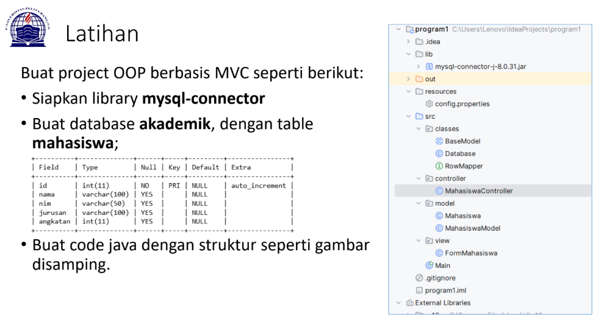
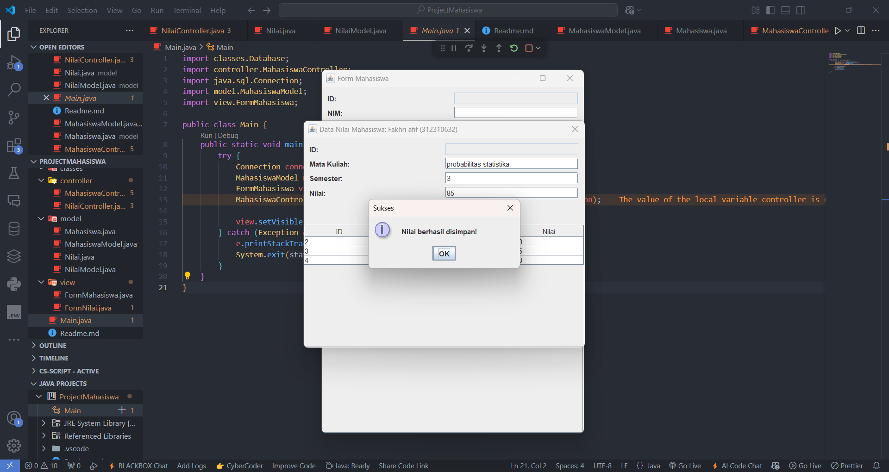

## Project OOP Berbasis MVC
| Pertemuan 13  |  Pemrograman Berorientasi Objek  
|-------|---------
| NIM   | 312310632
| Nama  | fakhri afif
| Kelas | TI.23.A6

[Link Penjelasan Proses Pembuatan Program | YouTube](https://youtu.be/cp13Lnw9yRg)


## Latihan OOP



### KONFIGURASI DATABASE DI MYSQL

**- #mysql -h127.0.0.1 -uroot**

```
CREATE DATABASE akademik;
```
```
USE akademik;
```
```
CREATE TABLE mahasiswa (
    id INT PRIMARY KEY AUTO_INCREMENT,
    nim VARCHAR(20) NOT NULL UNIQUE,
    nama VARCHAR(100) NOT NULL,
    jurusan VARCHAR(50) NOT NULL,
    angkatan VARCHAR(100) NOT NULL
);
```
```
CREATE TABLE nilai (
    id INT PRIMARY KEY AUTO_INCREMENT,
    mahasiswa_id INT NOT NULL,
    mata_kuliah VARCHAR(100) NOT NULL,
    semester INT NOT NULL,
    nilai CHAR(2),
    FOREIGN KEY (mahasiswa_id) REFERENCES mahasiswa(id)
    ON DELETE CASCADE
);
```

### STRUKTUR PROYEK

**- Proyek ini menggunakan arsitektur MVC (Model-View-Controller) dengan struktur folder:**


**- classes:** Berisi kelas-kelas dasar dan utilitas

**- controller:** Berisi logic untuk mengontrol alur data

**- model:** Berisi struktur data dan operasi database

**- view:** Berisi tampilan GUI

**- Main.java:** File utama untuk menjalankan aplikasi


### Tampilan Awal Program Saat Dijalankan / Dirunning

Pada saat program dijalankan / di running akan menghasilkan output seperti diatas ini
- Menampilkan Form Mahasiswa utama dengan tabel yang berisi data 4 mahasiswa
- Data yang ditampilkan: ID, NIM, Nama, Jurusan, dan Angkatan
- Memiliki field kosong di atas untuk input data baru
- Terdapat 4 tombol: Save, Delete, Clear, dan Lihat Nilai

<br> <br>


### Tampilan Ketika Penambahan Data Mahasiswa

berikut adalah proses penambahan mahasiswa baru dengan field yang diisi adalah bagian `NIM`, `Nama`, `Jurusan`, `Angkatan`.

<br> <br>


### Tampilan Ketika Penambahan Data Mahasiswa Berhasil

Pada saat setelah mengklik tombol `Save`, muncul popup dengan pesan `"Data saved successfully!"`. Menandakan data mahasiswa baru berhasil disimpan ke database.

<br> <br>


### Tampilan Ketika Data Mahasiswa Berhasil Ditambahkan

Data mahasiswa baru (sofyan) sudah muncul di tabel, terlihat sebagai record ke-5 dalam tabel. Semua field input kembali kosong setelah penyimpanan.

<br> <br>


### Tampilan Ketika Gagal Akan Melihat Nilai

Mencoba mengklik tombol `Lihat Nilai` tanpa memilih data akan memunculkan pesan `Pilih siswanya terlebih dahulu!`. Menunjukkan validasi bahwa user harus memilih data `Mahasiswa` nya terlebih dahulu untuk bisa melihat nilai dari `Mahasiswa`nya tersebut.

<br> <br>


### Tampilan Ketika Memilih Mahasiswa

Kembali ke tampilan normal `Form Mahasiswa`. Dan pemilihan `Mahasiswa` terlebih dahulu untuk melihat `Nilai` data dari si `Mahasiswa`.

<br> <br>


### Tampilan Ketika Menambahkan Sebuah Data Nilai Dari Mahasiswa

- Muncul form baru Data Nilai Mahasiswa : Fakhri afif (312220632).
- Mengisi field `Mata Kuliah` `Semester` `Nilai`.

<br> <br>


### Tampilan Ketika Data Nilai Berhasil Disimpan 

Setelah klik Save, muncul popup `Nilai berhasil disimpan!`.

<br> <br>


### Tampilan Ketika Setelah Selesai Penambahan Data Nilai

- Data nilai yang baru diinput muncul di tabel nilai
- Menampilkan `ID (5)`, `Mata Kuliah (Probabilitas statistika)`, `Semester (3)`, dan `Nilai (80)`.

<br>


Program ini menggunakan konsep form management yang baik dengan validasi data dan feedback user melalui popup messages. Interface dibuat user-friendly dengan tabel untuk menampilkan data dan form input yang jelas.


## Selesai
